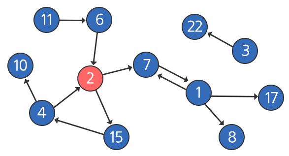
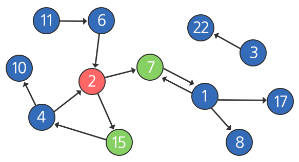
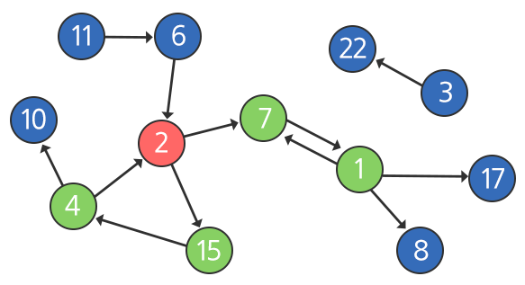
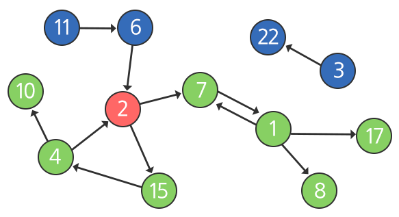

## 1238\. [S/W 문제해결 기본] 10일차 - Contact

-----

### 📝 문제 설명

비상연락망과 연락을 시작하는 당번에 대한 정보가 주어질 때, 가장 나중에 연락을 받게 되는 사람 중 번호가 가장 큰 사람을 구하는 함수를 작성하시오.

아래는 비상연락망을 나타낸 그림입니다.

각 원은 개개인을 의미하며, 원 안의 숫자는 그 사람의 번호를 나타내고 빨간원은 연락을 시작하는 당번을 의미합니다. 화살표는 연락이 가능한 방향을 의미합니다.

위의 예시에서는 7번과 1번은 서로 연락이 가능하지만, 2번과 7번의 경우 2번은 7번에게 연락할 수 있지만 7번은 2번에게 연락할 수 없습니다.

비상연락망이 가동되면 연락을 시작하는 당번인 2번은 연락 가능한 7번과 15번에 동시에 연락을 취합니다 (다자 간 통화를 사용한다고 가정).

그 다음, 7번은 1번에게, 15번은 4번에게 동시에 연락을 취합니다.

그 다음, 1번은 8번과 17번에게, 4번은 10번에게 동시에 연락합니다. 7번과 2번은 이미 연락을 받은 상태이므로 다시 연락하지 않습니다.


위 모습이 연락이 끝난 마지막 모습이 되며, 마지막에 동시에 연락 받은 사람은 8번, 10번, 17번 세 명입니다. 이 중에서 가장 숫자가 큰 사람은 17번이므로 17을 반환하면 됩니다.

※ 3, 6, 11, 22번은 시간이 지나도 연락을 받지 못합니다.

### ⚙️ 제약 사항

  * 연락 인원은 최대 100명이며, 부여될 수 있는 번호는 1이상, 100이하이다.
  * 중간 중간에 비어있는 번호가 있을 수 있다.
  * 한 명의 사람이 다수의 사람에게 연락이 가능한 경우 항상 다자 간 통화를 통해 동시에 전달한다.
  * 연락이 퍼지는 속도는 항상 일정하다 (전화를 받은 사람이 다음 사람에게 전화를 거는 속도는 동일).
  * 비상연락망 정보는 사전에 공유되며 한 번 연락을 받은 사람에게 다시 연락을 하는 일은 없다.
  * 연락을 받을 수 없는 사람도 존재할 수 있다.

### 📥 입력

총 10개의 테스트 케이스가 주어진다.

각 테스트 케이스의 첫 번째 줄에는 입력받는 데이터의 길이와 시작점이 주어진다.

그 다음 줄에 `{from, to, from, to, …}` 순서로 비상연락망 데이터가 주어진다. 데이터의 순서는 상관이 없으며, 동일한 `{from, to}` 쌍이 여러 번 반복될 수 있다.

### 📤 출력

## `#`부호와 함께 테스트 케이스의 번호를 출력하고, 공백 문자 후 테스트 케이스에 대한 답(가장 나중에 연락받는 사람 중 가장 번호가 큰 사람)을 출력한다.

### ⌨️ 입출력 예시

#### 입력

```
24 2
100 17 39 22 100 8 100 7 7 100 2 7 2 15 15 4 6 2 11 6 4 10 4 2
286 42
42 68 35 1 70 25 79 59 63 65 6 46 82 28 62 92 96 43 28 37 92 5 3 54 93 83 22 17 19 96 48 27 72 39 70 13 68 100 36 95 4 12 23 34 74 65 42 12 54 69 48 45 63 58 38 60 24 42 30 79 17 36 91 43 89 7 41 43 65 49 47 6 91 30 71 51 7 2 94 49 30 24 85 55 57 41 67 77 32 9 45 40 27 24 38 39 19 83 30 42 34 16 40 59 5 31 78 7 74 87 22 46 25 73 71 30 78 74 98 13 87 91 62 37 56 68 56 75 32 53 51 51 42 25 67 31 8 92 8 38 58 88 54 84 46 10 10 59 22 89 23 47 7 31 14 69 1 92 63 56 11 60 25 38 49 84 96 42 3 51 92 37 75 21 97 22 49 100 69 85 82 35 54 100 19 39 1 89 28 68 29 94 49 84 8 22 11 18 14 15 10 17 36 52 1 50 20 57 99 4 25 9 45 10 90 3 96 86 94 44 24 88 15 4 49 1 59 19 81 97 99 82 90 99 10 58 73 23 39 93 39 80 91 58 59 92 16 89 57 12 3 35 73 56 29 47 63 87 76 34 70 43 45 17 82 99 23 52 22 100 58 77 93 90 76 13 1 11 4 70 62 89 2 90 56 24 3 86 83 86 89 27 18 58 33 33 70 55 22 90
...
```

#### 출력

```
#1 17
#2 96
...
```