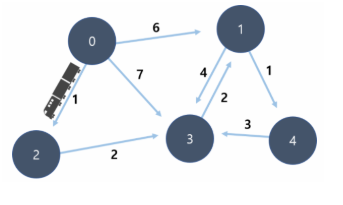
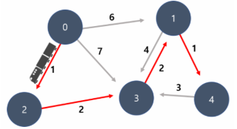

## 경민이의 기차 여행

-----

### 📝 문제 설명

경민이는 아르바이트로 모은 돈으로 기차 여행을 하고 있습니다.

아래 그래프에는 이동 경로마다 기차 비용이 적혀있습니다.

출발 지점에서 도착지점까지 가장 저렴한 방법으로 이동하려고 합니다.



만약 0번에서 출발하고 4번 지점이 도착지라면,

아래와 같은 경로로 이동하는 것이 최소 비용의 경로입니다.

이 비용이라면, 돈을 아껴 맛있는 식사를 할 수 있을 것 같습니다.



경민이를 위해 가장 저렴한 노선의 비용을 알려주는 프로그램을 제작해 주세요.

### ⚙️ 제약 사항

  - 정점의 개수 N과 간선의 수 T: 1 \<= N \<= 2,000 , 1 \<= T \<= 300,000
  - 모든 정점에는 0번 부터 N-1번까지 번호가 매겨져 있다고 가정합니다.
  - 노선 정보 (a, b, w): a와 b는 서로 다르며, 1 \<= w \<= 10,000 의 자연수

### 📥 입력

첫 줄에는 테스트 케이스의 수 T 가 주어집니다.

각 테스트케이스의 첫 줄에는 정점의 개수 N과 간선의 수 T를 입력 받습니다.

둘째 줄부터 T 개의 노선 정보를 입력 받는데, 각 줄마다 3개의 정수 (a, b, w)로 입력 받습니다.

이는 시간이 w 만큼 걸리는 a 에서 b로 가는 간선이 존재한다는 뜻입니다.

예를들어 0 2 4 인 경우 0번에서 2번 노드까지 도착하는데 걸리는 시간은 4 입니다.

### 📤 출력

0번 노드에서 출발하여 N - 1 노드에 도착해야 합니다.

이때, 가장 저렴하게 갈수 있는 비용을 출력해 주세요.

만약 갈수 있는 길이 없다면, **"impossible"** 을 출력합니다.

### ⌨️ 입출력 예시

#### 입력

```
2
5 8
0 1 6
0 2 1
0 3 7
2 3 2
3 1 2
1 3 4
1 4 1
4 3 3
4 6
0 2 5
0 1 7
2 1 4
3 0 2
3 2 9
3 1 5
```

#### 출력

```
#1 6
#2 impossible
```