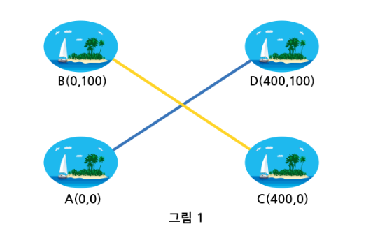
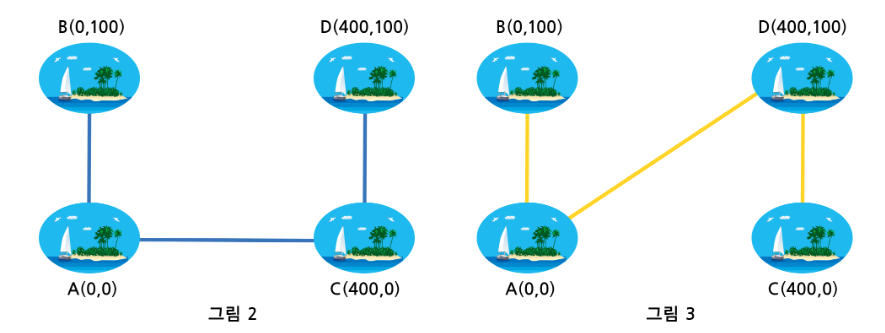

## 하나로

-----

### 📝 문제 설명

당신은 인도네시아 내의 N개의 섬들을 연결하는 교통시스템 설계 프로젝트인 ‘하나로’를 진행하게 되었습니다.

하나로 프로젝트는 천혜의 자연을 가진 인도네시아의 각 섬 간 교통이 원활하지 않아 관광 산업의 발전을 저해하는 요소를 줄이고 부가 가치를 창출하고자 진행하는 프로젝트입니다.

본 프로젝트에서는 인도네시아 내의 모든 섬을 해저터널로 연결하는 것을 목표로 합니다.

해저터널은 반드시 두 섬을 선분으로 연결하며, 두 해저 터널이 교차된다 하더라도 물리적으로는 연결되지 않는 것으로 가정합니다.

아래 그림 1과 같은 경우, A섬에서 D섬으로는 연결되었지만 A섬으로부터 B섬, C섬에는 도달 할 수 없기 때문에 연결되지 않은 것입니다.


다음 두 가지의 경우는 모든 섬이 연결된 것입니다.



위와 같은 방법을 통해 인도네시아 내의 모든 섬들을 연결해야 하는 프로젝트입니다.

그림 3에서 B와 A처럼 직접적으로 연결된 경우도 있지만, B와 C처럼 여러 섬에 걸쳐 간접적으로 연결된 경우도 있습니다.

다만 인도네시아에서는 해저터널 건설로 인해 파괴되는 자연을 위해 다음과 같은 환경 부담금 정책이 있습니다.

- 환경 부담 세율(E)과 각 해저터널 길이(L)의 제곱의 곱(E * L^2)만큼 지불

총 환경 부담금을 최소로 지불하며, N개의 모든 섬을 연결할 수 있는 교통 시스템을 설계하시오.

64비트 integer 및 double로 처리하지 않을 경우, overflow가 발생할 수 있습니다 (C/C++ 에서 64비트 integer는 long long 으로 선언).

위의 그림 2은 환경 부담금을 최소로 하며 모든 섬을 연결하고 있지만, 그림 3는 그렇지 않음을 알 수 있습니다.

### ⚙️ 제약 사항

  * 섬의 개수 N: $1 \le N \le 1,000$
  * 각 섬의 X, Y좌표: $0 \le X, Y \le 1,000,000$
  * 환경 부담 세율 E: $0 \le E \le 1$
  * 64비트 integer 및 double로 처리하지 않을 경우, overflow가 발생할 수 있습니다 (C/C++ 에서 64비트 integer는 long long 으로 선언).

### 📥 입력

가장 첫 줄은 전체 테스트 케이스의 수 T가 주어진다.

각 테스트 케이스의 첫 줄에는 섬의 개수 N이 주어진다.

두 번째 줄에는 각 섬들의 정수인 X좌표, 세 번째 줄에는 각 섬들의 정수인 Y좌표가 공백으로 구분되어 주어진다.

마지막으로, 해저터널 건설의 환경 부담 세율 실수 E가 주어진다.

### 📤 출력

각 테스트 케이스의 답을 순서대로 출력하며, 각 케이스마다 줄의 시작에 “\#C”를 출력하여야 한다. 이때 C는 케이스의 번호이다.

같은 줄에 빈칸을 하나 두고, 주어진 입력에서 모든 섬들을 잇는 최소 환경 부담금을 소수 첫째 자리에서 반올림하여 정수 형태로 출력하라.

### ⌨️ 입출력 예시

#### 입력

```
10
2
0 0
0 100
1.0
4
0 0 400 400
0 100 0 100
1.0
6
0 0 400 400 1000 2000
0 100 0 100 600 2000
0.3
9
567 5 45674 24 797 29 0 0 0
345352 5464 145346 54764 5875 0 3453 4545 123
0.0005
```

#### 출력

```
#1 10000
#2 180000
#3 1125000
. . .
```